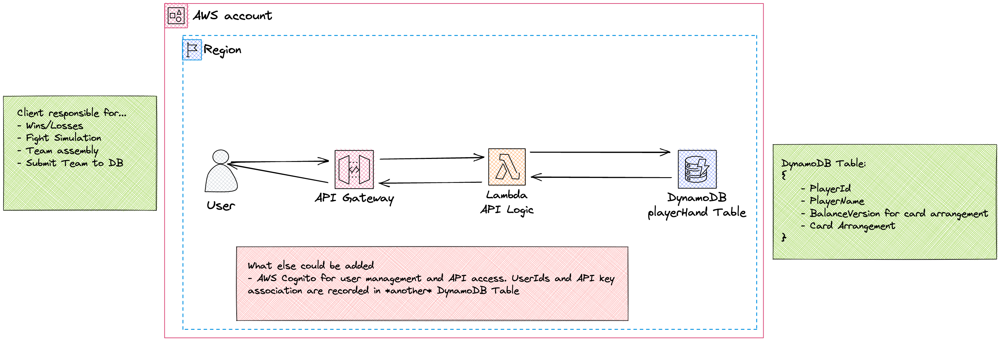

# game-off-2022 - Combat by Trial

GIthub Game Off 2022 Submission

## Backend Infra

The game's backend is a [basic CRUD API](https://docs.aws.amazon.com/apigateway/latest/developerguide/http-api-dynamo-db.html) that runs off of Amazon Web Services. The core components are:

- An API Gateway
- A Lambda function with the API logic (in API gateway, the Lambda is the request handler, and responder. This is known as a proxy configuration)
- A DynamoDB Table for `playerHand` entries
  - `playerHand` refers to an object featuring: `playerName`, `playerId`, `version`, and `cards`.

The above infrastructure is defined, configured, and deployed using [AWS CDK](https://docs.aws.amazon.com/cdk/v2/guide/home.html). The infrastructure is mostly named, and identified with the game's original working title `LegalBrawl`.

### Diagram

### How it works

Let's get something out of the way first: Yes, the API Key for the API Gateway _isn't_ a secret. This may change in a future iteration where individual playerIds are associated with their own API key. We're setting foundations here.

Moving on...

The API listens and responds to 4 HTTP methods **POST**, **GET**, **PUT**, and **OPTIONS**. At a high level, the methods do the following:

- **POST**: The client sends `playerHand` info, and writes it to the `playerHand` table. The API checks if whether or not the `playerId` already exists.
- **GET**: The client sends their `playerId`. If the `playerId` exists for that balance `version`, the API responds with another player's `playerHand` for matchmaking.
- **PUT**: The client sends their `playerHand` info. If the `playerHand` already exists for that balance `version`, then `cards` arranagement is checked to see if it is a 1:1 match. If it isn't, then the `playerHand`'s `cards` databasee item is updated for the specified `playerId` in the request.
- **OPTIONS**: This only returns the minimum headers to satisfy CORS requirements. It functionally does nothing else, for now.

The Lambda function performs the parsing and responding to of requests. The API gateway directs the requests.

## Retrospective Notes & Commentary

### First Time working with CORS?

For us, this was certainly the case!

The most difficult part when setting up the API was working with CORS policies. The gist is, there are [3 minimum headers](https://docs.aws.amazon.com/apigateway/latest/developerguide/how-to-cors.html#apigateway-responding-to-cors-preflight):

1. Access-Control-Allow-Methods
2. Access-Control-Allow-Headers
3. Access-Control-Allow-Origin

Not only do you need an OPTIONS HTTP Method for your API, but you also need to return these headers in your API responses in order to satisfy cross-origin requests.

You can either do this in API Gateway, or as we have done, write your Lambda code so that you _API responds with these headers_.

We personally ran into difficulty understanding how to satisfy basic CORS for the game running on `itch.io`. After many StackOverflow threads, and AWS Documentation, it wasn't made incredibly clear that the headers were supposed to be in _all_ responses.
